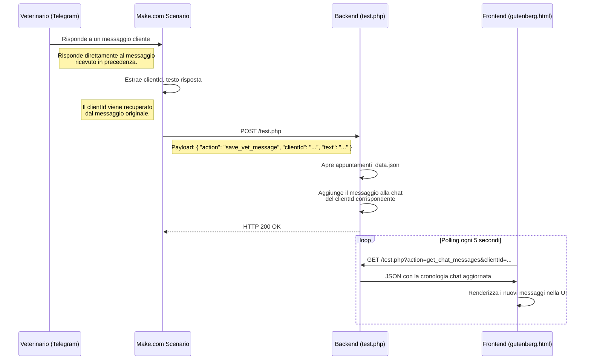

# Architecture Design: VettyBMAD MVP

## 1. Panoramica

**Progetto:** VettyBMAD - Chat Bidirezionale
**Data:** 2024-07-16
**Autore:** Gemini (nel ruolo di Architect BMAD)

Questo documento descrive l'architettura della soluzione per implementare la funzionalità di chat bidirezionale come definito nel PRD. L'obiettivo è estendere il sistema esistente con modifiche minime ma efficaci per raggiungere la funzionalità richiesta per l'MVP.

## 2. Architettura di Riferimento (MVP)

L'architettura si basa sui componenti esistenti, estendendoli per permettere il flusso di dati inverso (dal veterinario al cliente).

**Componenti:**

1.  **Frontend (Web):** Il file `gutenberg.html` su WordPress.
2.  **Integrazione (Middleware):** Lo scenario su Make.com.
3.  **Backend (API Semplice):** Il file `test.php`.
4.  **Archiviazione (Data Store):** Il file `appuntamenti_data.json`.

### Flusso dei Dati (Da Veterinario a Cliente)



## 3. Modifiche ai Componenti

### 3.1. Backend (`test.php`)

Il file dovrà essere modificato per gestire due azioni principali.

- **Azione 1: `save_vet_message`** (tramite POST)
  - Riceverà un payload JSON dal webhook di Make.com.
  - Dovrà decodificare il JSON e validare la presenza di `clientId` e `text`.
  - Leggerà `appuntamenti_data.json`, troverà l'oggetto corrispondente al `clientId`.
  - **Aggiungerà un nuovo oggetto messaggio all'array `chatHistory`** di quell'appuntamento. La struttura del messaggio è definita nella sezione 4.
  - Salverà il file `appuntamenti_data.json` aggiornato.

- **Azione 2: `get_chat_messages`** (tramite GET)
  - Riceverà un `clientId` come parametro URL.
  - Leggerà `appuntamenti_data.json`, troverà l'oggetto per il `clientId`.
  - Restituirà l'array `chatHistory` (o un array vuoto se non esiste) come risposta JSON, con `Content-Type: application/json`.
  - Dovrà anche gestire il caso in cui il `clientId` non venga trovato.

### 3.2. Frontend (`gutenberg.html`)

Le modifiche si concentreranno sul file JavaScript all'interno dell'HTML.

- **Rimozione Logica Fittizia:** La funzione `setTimeout` che simula una risposta del bot dopo 2 secondi deve essere rimossa dalla funzione `sendMessage`.
- **Polling dei Messaggi:** Verrà implementata una funzione `fetchMessages()` che:
  - Esegue una chiamata `fetch` all'endpoint `test.php?action=get_chat_messages&clientId=...`.
  - Confronta i messaggi ricevuti con quelli già visualizzati per evitare duplicazioni.
  - Chiama una funzione `renderMessage()` per ogni nuovo messaggio.
- **Esecuzione Periodica:** `setInterval(fetchMessages, 5000)` verrà avviato dopo che l'utente ha inviato il primo messaggio (e quindi ha un `clientId` valido) per interrogare il server ogni 5 secondi.
- **Renderizzazione Messaggi:** La funzione `renderMessage(message)`:
  - Creerà un nuovo `div` per il messaggio.
  - Applicherà una classe CSS diversa a seconda di `message.sender` (`user` o `vet`) per l'allineamento a sinistra/destra.
  - Aggiungerà il `div` al contenitore della chat e farà lo scroll automatico verso il basso.

### 3.3. Integrazione (Make.com)

Il blueprint `Integration Telegram Bot, Webhooks.blueprint.json` dovrà essere modificato.

- **Trigger:** Il trigger attuale che ascolta i nuovi messaggi in arrivo al bot rimane invariato.
- **Nuovo Flusso per le Risposte:** Si aggiungerà un nuovo percorso nel scenario, o un nuovo scenario, che si attiva quando un messaggio in Telegram è una **risposta** a un messaggio precedente.
- **Recupero `clientId`:** Il `clientId` sarà estratto dal testo del messaggio originale a cui il veterinario sta rispondendo (il messaggio che il bot ha inviato al veterinario).
- **Azione Webhook:** L'azione finale sarà un modulo "HTTP Request" configurato per inviare una richiesta **POST** all'URL del file `test.php`, passando un corpo JSON formattato come segue:
  ```json
  {
    "action": "save_vet_message",
    "clientId": "[clientId recuperato]",
    "text": "[testo della risposta del veterinario]"
  }
  ```

## 4. Struttura Dati

Per supportare la chat, la struttura dati all'interno di `appuntamenti_data.json` per ogni appuntamento sarà estesa per includere un array `chatHistory`.

```json
{
  "clientId": "some-unique-id",
  "dateTime": "2024-07-16T10:00:00Z",
  "details": "Il mio cane non mangia",
  "chatHistory": [
    {
      "sender": "user",
      "text": "Il mio cane non mangia",
      "timestamp": "2024-07-16T10:00:00Z"
    },
    {
      "sender": "vet",
      "text": "Ha provato a dargli del riso bollito?",
      "timestamp": "2024-07-16T10:05:00Z"
    }
  ]
}
```

- `sender`: Può essere `"user"` o `"vet"`.
- `text`: Il testo del messaggio.
- `timestamp`: L'orario di invio del messaggio.

## 5. Rischi e Mitigazione (MVP)

- **Rischio 1: Concorrenza di Scrittura su JSON.**
  - **Descrizione:** Due richieste che tentano di scrivere su `appuntamenti_data.json` contemporaneamente potrebbero corrompere il file.
  - **Mitigazione MVP:** Per il volume di traffico previsto per l'MVP, questo rischio è basso. Verrà utilizzato `flock` (file locking) in PHP per garantire scritture atomiche e ridurre questo rischio.
  - **Futuro:** Migrazione a un database (es. SQLite o MySQL) come raccomandato nel PRD.

- **Rischio 2: Sicurezza dell'Endpoint.**
  - **Descrizione:** L'endpoint `get_chat_messages` è pubblico e chiunque conosca un `clientId` può visualizzare una chat.
  - **Mitigazione MVP:** Il `clientId` è un UUID, rendendolo difficile da indovinare. Questo è accettabile per l'MVP, dato che non vengono scambiate informazioni altamente sensibili. L'accesso è limitato alla lettura.
  - **Futuro:** Implementare un sistema di autenticazione basato su token o sessioni.

## 6. Documentazione Dettagliata

Per una comprensione più approfondita dei singoli componenti, si prega di consultare i seguenti documenti:

- **[Documentazione API Backend (`test.php`)](./backend-api.md)**: Descrive in dettaglio tutti gli endpoint, i payload e le risposte del backend.
- **[Documentazione Logica Frontend (`gutenberg.html`)](./frontend-logic.md)**: Spiega il funzionamento dello script lato client, inclusa la gestione del `clientId` e il polling dei messaggi.
